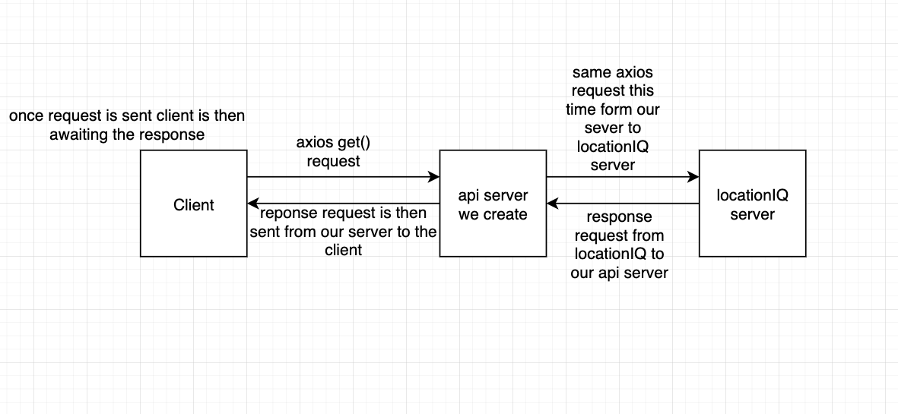

>**Lab:** #, **Feature:** #: #,
>>**Estimate amount of time needed to complete:** #,
>>>**Start time:** #,
>>>>**Finish time:** #,
>>>>>**Actual time needed to complete:** #,
>>>>>>**Key requirements:** #.

>**LAB - Number -** 7
>>Project Name: **City Explorer** 
>>>Description: this API server will send data to a City-explorer App that will ask a user for a city name and display information regarding that city such as an image of a map and weather information,

>**Author: Brutalism**,
>>**Links and Resources:**
>>>**submission PR:** 
>>>>**URL:** https://city-explorer-brutal.netlify.app
>>>>>**GitHub Repo:** https://github.com/CodeFellows-SchoolWork/city-explorer-api
>>>>>>**Links you used as reference:**
>>>>>>>**Reflections and Comments:**

>**Lab:** 7, **Feature:** Weather (placeholder),
>>**Estimate amount of time needed to complete:** 5hr,
>>>**Start time:** 2:00pm Sat-Jul-31,
>>>>**Finish time:** #,
>>>>>**Actual time needed to complete:** #,
>>>>>>**Key requirements:** Build an abi that when called sends information from the backend to the front end for the client is see the requested data.

